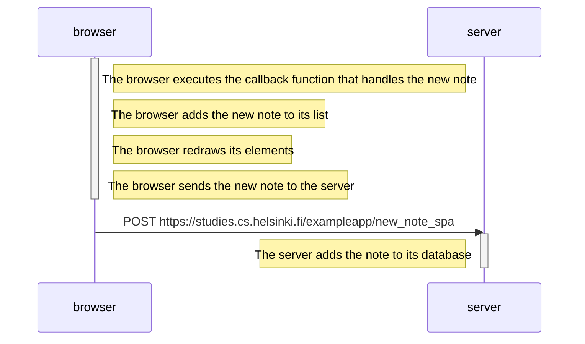

Sequence diagram for new note in single-page app

```mermaid
sequenceDiagram
    participant browser
    participant server

    activate browser
    Note right of browser: The browser executes the callback function that handles the new note
    Note right of browser: The browser adds the new note to its list
    Note right of browser: The browser redraws its elements

    Note right of browser: The browser sends the new note to the server

    deactivate browser
    browser->>server: POST https://studies.cs.helsinki.fi/exampleapp/new_note_spa

    activate server
    Note left of server: The server adds the note to its database
    deactivate server
```
